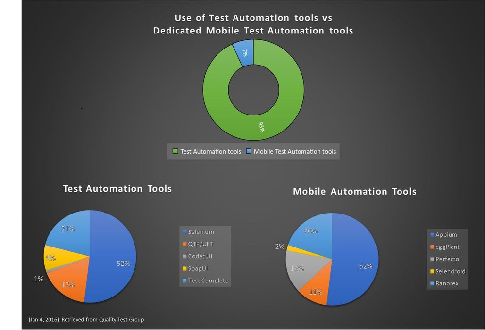

# appium_demo

    

This demo is to show how appium is implemented. 

Attached with this project is automation presentation with suggested action plans and details regarding cross-platform testing. 

Components used 
- Appium GUI Server -> https://github.com/appium/appium-desktop/releases/tag/v1.22.3-4
- Appium UI Automator/Inspector -> https://github.com/appium/appium-inspector/releases
- Intellij Community Edition/ Java/Kotlin -> https://www.jetbrains.com/idea/download/#section=mac
- Android Studio/Android emulator -> https://developer.android.com/studio?gclid=CjwKCAiAv9ucBhBXEiwA6N8nYMrssOLCa2q76NSqMKedt6aMRUXC7gZcCTxf_1LP7r1gHKuEwuj3ARoCbfEQAvD_BwE&gclsrc=aw.ds
- Xcode/IOS Simulator -> https://developer.apple.com/xcode/
- Android App Link -> https://github.com/MuhammadAbdulSalam/salam_currency_demo
- IOS App Link -> https://github.com/MuhammadAbdulSalam/ios_appium_app

Appium GUI Server -> Appium server GUI to start server and create a port for emulator

Appium UI Automator/Inspector -> Emulate to browser and search for web elements

Intellij -> IDE used to write test scripts

Android Studio -> For Android emulator and Robot Pattern UI Testing

XCode -> IOS Simulator and Robot Pattern Testing

Android App Link -> See examples of Android Robot Pattern

IOS App Link -> See Example of IOS Robot Pattern 

